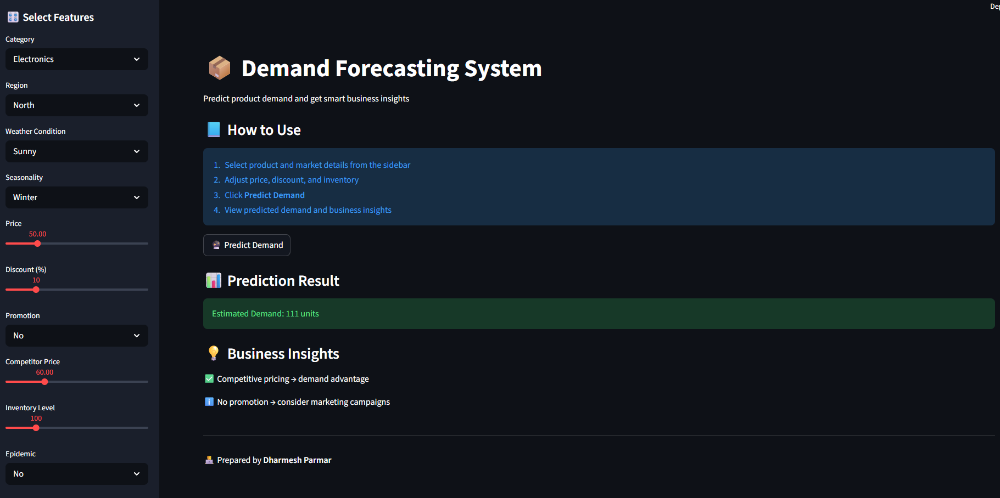

# 📦 Demand Forecasting System

## Overview
The Demand Forecasting System is an end-to-end Machine Learning application designed to predict product demand based on business and external factors such as pricing, promotions, inventory levels, and market conditions.

This project helps businesses make data-driven decisions to improve sales performance, optimize inventory, and plan effective promotional strategies.

---

## Table of Contents
- [Overview](#overview)
- [App Preview](#app-preview)
- [Business Problem](#business-problem)
- [Dataset](#dataset)
- [Project Pipeline](#project-pipeline)
- [Key Insights](#key-insights)
- [Features](#features)
- [Tech Stack](#tech-stack)
- [How to Run](#how-to-run)
- [Live App](#live-app)
- [Project Structure](#project-structure)
- [Disclaimer](#disclaimer)
- [Author](#author)

---
## App Preview

----
## Business Problem
Businesses often face challenges in accurately predicting product demand, which can lead to:
- Overstocking and increased holding costs
- Stockouts and lost sales opportunities
- Inefficient pricing and promotion strategies

This project aims to solve these problems by providing a predictive system that estimates demand and offers actionable insights.

---

## Dataset
The dataset contains over 76,000 records with key features such as:
- Product Category and Region
- Price and Discount
- Inventory Level and Units Sold
- Promotion and Competitor Pricing
- Weather Conditions and Seasonality
- External factors like Epidemic impact

---

## Project Pipeline

### 1. Data Cleaning
- Handled data types and ensured consistency
- Converted date fields into usable format
- Verified no missing values in dataset

### 2. Exploratory Data Analysis (EDA)
- Analyzed demand distribution
- Identified relationship between price and demand
- Evaluated promotion and category impact
- Derived business-focused insights

### 3. Feature Engineering
- Created time-based features (Day, Weekend)
- Developed pricing features (Price Difference, Price Ratio)
- Built interaction features (Promo Discount, Epidemic Impact)
- Applied transformations like Log Inventory

### 4. Model Building
- Used multiple models (Linear, Random Forest, XGBoost)
- Implemented Pipeline with preprocessing
- Selected Random Forest as best model

### 5. Model Evaluation
- Evaluated using MAE, RMSE, and R²
- Achieved stable and reliable performance for business use

### 6. Deployment
- Built interactive Streamlit application
- Integrated model for real-time predictions
- Added business insights and user-friendly interface

---

---

## Key Insights
- Pricing is the strongest driver of demand
- Promotions and discounts significantly boost sales
- Customers are highly sensitive to competitor pricing
- Product category plays a major role in demand variation
- Inventory ensures availability but does not directly increase demand
- External factors like weather and epidemic influence buying patterns

---

## Features
- Real-time demand prediction using Streamlit
- Interactive sidebar inputs (dropdowns, sliders, Yes/No)
- Dynamic business insights based on user input
- Clean and professional dark-themed UI
- End-to-end ML pipeline integration
- Easy-to-use interface for non-technical users

---

## Tech Stack
- Python
- Pandas
- NumPy
- Scikit-learn
- XGBoost
- Streamlit
- Joblib

---

## How to Run
Clone the repository  
Navigate to the project folder  
Install dependencies using: pip install -r requirements.txt  
Run the application using: streamlit run app.py  

---

## Live App

App link click here : https://demand-forecasting-system-ml-jhwa89jmmcy6bqiwgdsh8i.streamlit.app/  

---

## Project Structure
demand-forecasting-system/  
│  
├── app.py  
├── requirements.txt  
├── models/  
│   └── demand_model.pkl  
├── Images/  
│   └── app.png  
└── .streamlit/  
    └── config.toml  

---

## Disclaimer
This project is developed for educational and demonstration purposes. Predictions are based on historical data and may not fully represent real-world uncertainties.

---

## Author
Dharmesh Parmar  
Data Analyst | Machine Learning Enthusiast
